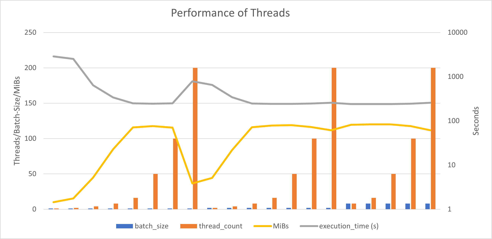
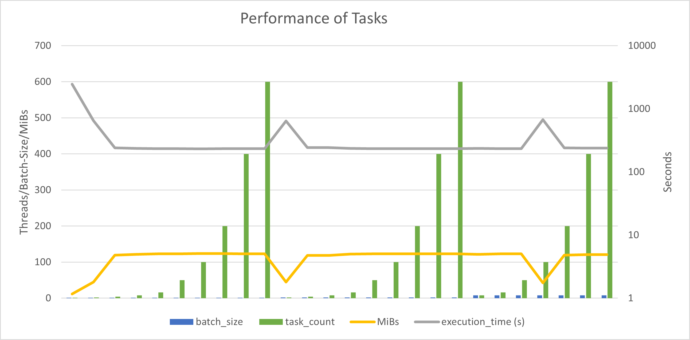

# MPV3 - Mandelbrot CPU & CUDA
## PC Specs
* CPU: Intel(R) Core(TM) i7-5820K CPU @ 3.30GHz   3.30 GHz
* RAM: 16.0 GB DDR4 2133 MHz
* GPU: NVIDIA GeForce RTX 2070 SUPER', cc 7.5, 8.0 GiB, 40960 Threads

## 1. CPU Comparison
The CPU implementation was compared with different numbers of threads and tasks. Also a different batch_size (number of images produced at the same time) was used. The results are measured in time (s) and MiBs (Mebibytes per second).

### CPU Tuning
The following things were optimized:
* using `complex_t` from `complex.h` instead of `std::complex`
* better memory access for bitmap (instead of `.at()`, direct memory access)
* using `square, norm` etc. from `complex.h` 
* little multiplication/addition optimizations in the mandelbrot Loop

### Threads
| batch_size | thread_count | execution_time (s) | MiBs   |
|------------|--------------|--------------------|--------|
| 1          | 1            | 2892,040           | 9,958  |
| 1          | 2            | 2526,550           | 15,362 |
| 1          | 4            | 641,541            | 44,892 |
| 1          | 8            | 339,494            | 84,832 |
| 1          | 16           | 249,069            | 115,631|
| 1          | 50           | 245,059            | 117,523|
| 1          | 100          | 249,267            | 115,539|
| 1          | 200          | 786,618            | 36,612 |
| 2          | 2            | 651,098            | 44,233 |
| 2          | 4            | 344,190            | 83,675 |
| 2          | 8            | 248,035            | 116,113|
| 2          | 16           | 243,226            | 118,408|
| 2          | 50           | 241,883            | 119,066|
| 2          | 100          | 247,509            | 116,360|
| 2          | 200          | 257,525            | 111,834|
| 8          | 8            | 240,914            | 119,545|
| **8**          | **16**           | **239,713**            | **120,144** |
| 8          | 50           | 240,117            | 119,941|
| 8          | 100          | 245,054            | 117,525|
| 8          | 200          | 257,919            | 111,663|

### Tasks
| batch_size | task_count | execution_time (s) | MiBs   |
|------------|------------|--------------------|--------|
| 1          | 1          | 2466,170           | 11,678 |
| 1          | 2          | 647,611            | 44,471 |
| 1          | 4          | 240,791            | 119,606|
| 1          | 8          | 236,838            | 121,602|
| 1          | 16         | 234,349            | 122,894|
| 1          | 50         | 233,460            | 123,361|
| **1**          | **100**        | **232,895**            | **123,661** |
| 1          | 200        | 232,971            | 123,621|
| 1          | 400        | 233,573            | 123,302|
| 1          | 600        | 233,545            | 123,317|
| 2          | 2          | 645,148            | 44,641 |
| 2          | 4          | 242,212            | 118,904|
| 2          | 8          | 242,696            | 118,667|
| 2          | 16         | 235,661            | 122,210|
| 2          | 50         | 233,956            | 123,100|
| 2          | 100        | 233,986            | 123,084|
| 2          | 200        | 234,033            | 123,060|
| 2          | 400        | 233,970            | 123,093|
| 2          | 600        | 234,163            | 122,991|
| 8          | 8          | 236,453            | 121,800|
| 8          | 16         | 234,582            | 122,772|
| 8          | 50         | 233,508            | 123,336|
| 8          | 100        | 676,398            | 42,579 |
| 8          | 200        | 241,649            | 119,181|
| 8          | 400        | 238,711            | 120,648|
| 8          | 600        | 238,209            | 120,902|

**Tasks vs. Threads:** Tasks performed better in average, probably because of thread creation overhead. Also the best result is around **2,93%** better than the best result with threads.

**Best Result:** 232,895 s (123,661 MiBs/s) with 100 tasks and batch_size 1.

### Comparing Graphs

Performance dropped with too many threads by image. It did not make that much of a difference when			
creating multiple images at the same time. 			

The Tasks were more time-consistent than threads. Also had weird performance drops for 2 tasks			
which might be because of an error in the implementation. Image batch size did not matter at all			
it seems.			

## 2. CUDA Implementation
To make the project run on CUDA, the following steps were taken:
* Created `shared.h` containing `__constant__` variables and functions used by both CPU and GPU.
* Created `cuda_helper.h` containing `check` and other helping functions.
* Added a kernel header and implementation
  * The outside function takes the dimensions of the grid/blocks and mandelbrot arguments. Returns a `cudaError_t`.	
  * The inside kernel function calculates a single pixel depending on the block index.
* The `gpu.cpp` calls the kernel for a specified job and calculates speedup etc after the kernels are synchronized.

### CUDA Results Version 1
Seconds: 8.97772  
MiB/s: 3207.94  
Speedup (best CPU): 25.9414  
Speedup (best GPU): -1 (no previous GPU result)  

## 3. CUDA Tuning
