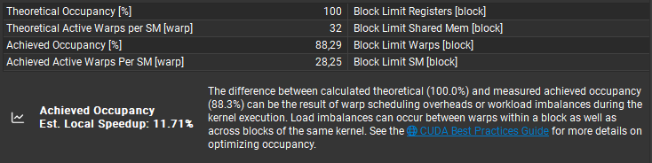
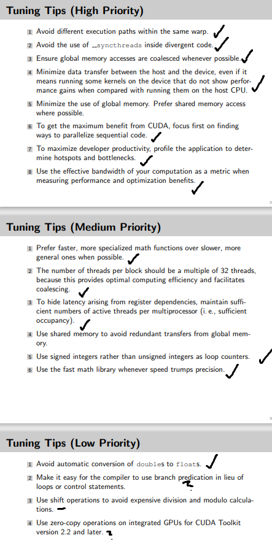

# CUDA Tuning 
* Optimizing job 200
* Image dimensions: 8192x4607
* Image size: 144 MiB
* Colors: 128

## Starting Point
### Baseline (CPU)
- **Seconds:** 232.895
- **MiB/s:** 123.661

### Baseline (GPU)
- **Seconds:** 8.97772
- **MiB/s:** 3207.94
- **Speedup (Best CPU):** 25.9414

## Improvements
### Using Raw-Pointers instead of Shared
- **Seconds:** 6.10271
- **MiB/s:** 4719.22
- **Speedup (Best CPU):** 38.1625
- **Speedup (Best GPU):** 1.47111

### cudaMalloc on Device only once, reusing Memory
- **Seconds:** 4.93172
- **MiB/s:** 5839.74
- **Speedup (Best CPU):** 47.2238
- **Speedup (Best GPU):** 1.23744

### Allocating host memory with `cudaMallocHost` (pinned memory): 10% performance increase
  - **Seconds:** 3.99189
  - **MiB/s:** 7214.62
  - **Speedup (Best CPU):** 58.3419
  - **Speedup (Best GPU):** 1.10843

### Using uint8_t Instead of pixel_t for Transfer, Calculating Colors on CPU at Compile-Time
- **Seconds:** 5.8341
- **MiB/s:** 4936.49
- **Speedup (Best CPU):** 39.9196
- **Speedup (Best GPU):** 0.845327

Initial slowdown was compensated by adding `pragma omp` for Pixel-Lookup on CPU.
- **Seconds:** 4.51053
- **MiB/s:** 6385.06
- **Speedup (Best CPU):** 51.6336
- **Speedup (Best GPU):** 1.09338

Also optimized coalesced memory access. From ~34 to 18.

### Streaming Implementation
Now the biggest performance bottleneck was serial memory transfer/calculating. The goal is to solve this with implementing CUDA streams, and using buffered results.

Experiments:
- More Streams in single image: 60% performance decrease, aborted
  - **Seconds:** 9.82331
  - **MiB/s:** 2931.8
  - **Speedup (Best CPU):** 23.7084
  - **Speedup (Best GPU):** 0.40637
- Streaming per Job (single Stream): 5% performance increase
  - **Seconds:** 3.77102
  - **MiB/s:** 7637.2
  - **Speedup (Best CPU):** 61.7591
  - **Speedup (Best GPU):** 1.05857
 * Streaming with Async-Memory-Transfer, Buffering and CUDA events.

Using a single stream resulted in same performance as above, but way better performance with multiple streams (see below [Parameter Sweep for Streams and Buffer Size](#parameter-sweep-for-streams-and-buffer-size)).

After this our timeline looked like this:

### Other Improvements
- Using `cuFloatComplex` directly: No improvement
- `fmaf` in `complex_t::square()`: 1-5% performance increase
  - **Seconds:** 4.42474
  - **MiB/s:** 6508.85
  - **Speedup (Best CPU):** 52.6347
  - **Speedup (Best GPU):** 1.01939
- Inline calculations without `complex_t`: 5% performance decrease
- Optimizing variable types (`uint32, 16, etc.`): Minimal improvement

### Trials (No Significant Performance Gain)
- Manual loop unrolling and pragma unroll: No significant performance gain
- Removed first iteration and initialized `z` with `c`: Slight improvement
- Using `cuFloatComplex` (instead `complex_t`) directly: No improvement
- Inline calculations without `complex_t`: 5% performance decrease
- Optimizing variable types (`uint32, 16, etc.`): Minimal improvement

## Parameter Sweep for Streams and Buffer Size

**Results:** it's a tradeoff to use more memory to give the CPU time to do the color lookup, while the GPU writes a lot of images into the buffer. The best result was with 2 streams and 20 buffers (which was not that consistent). Results around (6,6) were much more reproducible. There is a memory limit, so the stream * buffer size cannot be too big.    

**Speedup CPU 111.297, Speedup GPU (baseline with 1 stream  and batch) 1.80211**

The biggest problem we removed here was waiting for the CPU bottleneck. So the batch size is more important than the number of streams. Streams still increase the performance but only to a certain point. 

## Parameter Sweep for Block Size, Occupancy
block_size,speedup(cpu) TODO format

## Final Results
Initial CPU MiB/s: 123.661  
Initial GPU MiB/s: 3207.94  

**Best Run**

Speedup (initial GPU)

Memory Throughput  

Roofline  

Throughput

Occupancy

Potential  

* Analyzed the Non-Fused Instructions, cannot find the reason
* Global Access was already optimized
* L2 Store is not worth optimizing with 1,8% Speedup

## Summarized
* occupancy optimization
* memory allocation optimization
  * pinned memory
  * cudaMalloc only once, reuse memory
  * raw pointers
* mathematical optimizations
* using constant memory
* **streams and buffers for results**
  * async memory transfer
  * cuda events
  * cuda streams
  * configurable buffer/stream count
* **precalculating colors, using CPU for lookup**
  * compile time `constexpr g_colors_map`
  * lookup done through `pragma omp for` on CPU
  * only transferring `uint8_t` instead of `pixel_t` (multiple times reduction)
  

## Tuning-Tips Checklist

